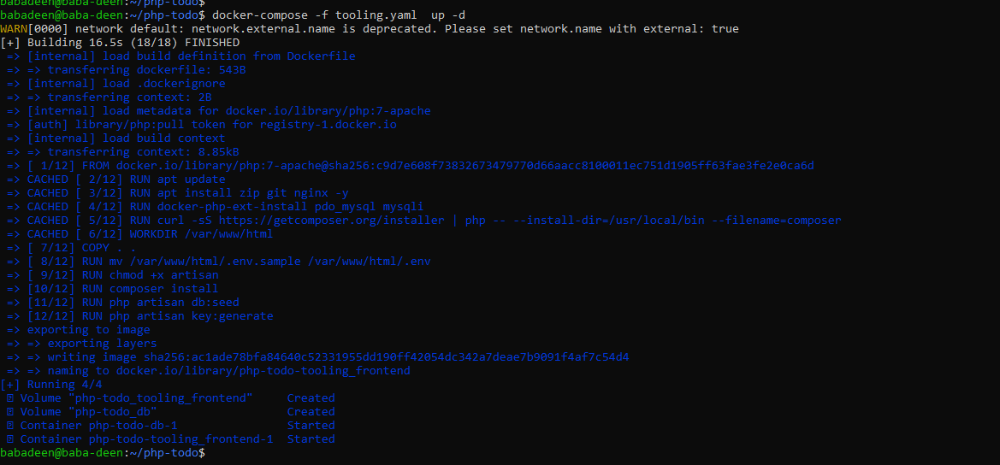

## MIGRATION TO THE СLOUD WITH CONTAINERIZATION. 
### PART 1 – DOCKER &  DOCKER COMPOSE

### Install Docker and prepare for migration to the Cloud, we need to install Docker Engine, which is a client-server application that contains:

- A server with a long-running daemon process `dockerd.`
- APIs that specify interfaces that programs can use to talk to and instruct the Docker daemon.
- A command-line interface (CLI) client docker.

### So, let us migrate the Tooling Web Application from a VM-based solution into a containerized one.

- MySQL in container -- pre-built MySQL database container, configure it, and make sure it is ready to receive requests from our PHP application.

- Step 1: Pull MySQL Docker Image from Docker Hub Registry.

       docker pull mysql/mysql-server:latest

       docker image ls` -- To list the downloaded image 

- Step 2: Deploy the MySQL Container to your Docker Engine Once you have the image, move on to deploying a new MySQL container with:

      docker run --name babadeen -e MYSQL_ROOT_PASSWORD=abcd1234 -d mysql/mysql-server:latest

      docker ps -a  -  To check if the mysql container is running

-  Step 3: Connecting to the MySQL Docker Container -- MySQL server:

       docker exec -it mysql bash or sh

       docker exec -it mysql-server mysql -uroot -p

      - Provide the root password when prompted. With that, you’ve connected the MySQL client to the server.

      - Finally, change the server root password to protect your database. Exit the the shell with exit command

- setting mysql root passoword within mysql databae before securing it`

       ALTER USER 'root'@'localhost' IDENTIFIED WITH mysql_native_password BY 'PassWord.1'; `

- starting interactive script 

        sudo mysql_secure_installation 

- logging into mysql after setting root passowrd 

       mysql -p 

- Step 4: To stop and remove a container do the below.
      
      docker ps -a
      docker stop mysql-server 
      docker rm mysql-server

- Step 5: For clarity’s sake add or create a custorm network for the docker containers dedicated for this project called `DRIVER Bridge` for both mysql and the application to connect. Even if we dont create it docker will create one.
      
      docker network create --subnet=172.20.0.0/24 tooling_app_network1

      docker network ls --- to check the network created 

- Run the MySQL Server container using the created network.

- First, let us create an environment variable to store the root password

       export MYSQL_PW=abcd1234

       echo $MYSQL_PW  -- To display the password set above

- Then, pull the image and run the container, all in one command like below:

       docker run --network tooling_app_network1 -h mysqlserverhost 
       --name=mysql-server -e MYSQL_ROOT_PASSWORD=$MYSQL_PW  
       -d mysql/ mysql-server:latest

       docker ps -a  -- to check if its running 

- It is best practice not to connect to the MySQL server remotely using the root user. Therefore, we will create an SQL script that will create a user we can use to connect remotely.

        vi create_user.sql

- paste the below in the file created above

       CREATE USER 'babadeen'@'%' IDENTIFIED BY 'abcd1234'; GRANT ALL PRIVILEGES ON * . * TO 'babadeen'@'%';

       
- Run the script: Ensure you are in the directory `create_user.sql` file is located or declare a path

       docker exec -i mysql-server mysql -uroot -p$MYSQL_PW < create_user.sql

- Step 6: Connecting to MySQL server from a second container running the MySQL client utility.

- Run the MySQL Client Container:

       docker run --network tooling_app_network1 --name mysql-client -it --rm mysql mysql -h mysqlserverhost -ubabadeen  -p

- Step 7: Prepare a database schema so that the Tooling application can connect to it.

- Clone the Tooling-app repository from `https://github.com/babalola1234/tooling-1.git`

       git clone https://github.com/babalola1234/tooling-1.git

- You can find the `tooling_db_schema.sql` in the `tooling-1/html/tooling_db_schema.sql` folder of cloned repo.

- Verify that the path is exported
        
        export tooling_db_schema=~/tooling_db_schema.sql

        echo $tooling_db_schema

- Use the SQL script to create the database and prepare the schema. With the docker exec command, you can execute a command in a running container.

       docker exec -i mysql-server mysql -uroot -p$MYSQL_PW < $tooling_db_schema

- Update the `.env ` file with connection details to the database. The .env file is located in the `html` `tooling-1/html/.env` folder but not visible in terminal.

       sudo vi .env

       MYSQL_IP=mysqlserverhost
       MYSQL_USER=babadeen
       MYSQL_PASS=abcd1234
       MYSQL_DBNAME=toolingdb

- Run the Tooling App
- Ensure you are inside the directory "tooling-1" that has the file `Dockerfile ` and build your container :

       docker build -t tooling:0.0.1 . 

- Run the container

       docker run --network tooling_app_network1 -p 8085:80 -it tooling:0.0.1

- If everything works, you can open the browser and type http://localhost:8085

## PRACTICE TASKS

### Task №1 – Implement a POC to migrate the PHP-Todo app into a containerized application

- Download php-todo repository -- https://github.com/babalola1234/php-todo.git

###  Part 1
- Write a `Dockerfile` for the TODO app
- Run both database and app on your laptop Docker Engine
- Access the application from the browser

### Todo app into a containerized application

-  Dockerfile for TODO app

        FROM php:7-apache
        LABEL MAINTAINER babadeen
        RUN apt update
        RUN apt install zip git nginx -y
        RUN docker-php-ext-install pdo_mysql mysqli
        RUN curl -sS https://getcomposer.org/installer | php -- --install-dir=/usr/local/bin --filename=composer

        WORKDIR /var/www/html

       COPY . .
       RUN mv /var/www/html/.env.sample /var/www/html/.env
       RUN chmod +x artisan

       RUN composer install
       RUN php artisan db:seed
       RUN php artisan key:generate

       CMD php artisan migrate
       ENTRYPOINT php artisan serve --host 0.0.0.0 --port 5001

      

- Creating a MySQL container server for the php-todo frontend

- First, let us create an environment variable to store the root password

       export MYSQL_PW=abcd1234
       echo $MYSQL_PW  -- To display the password set above

        docker run --network tooling_app_network -h mysqlserverhost --name=mysql-server -e MYSQL_ROOT_PASSWORD=$MYSQL_PW  -d mysql/mysql-server:latest

       docker ps -a  -- to check if its running 

- It is best practice not to connect to the MySQL server remotely using the root user. Therefore, we will create an SQL script that will create a user we can use to connect remotely.

        vi create_user.sql

- paste the below in the file created above

       CREATE USER 'babadeen'@'%' IDENTIFIED BY 'abcd1234'; GRANT ALL PRIVILEGES ON * . * TO 'babadeen'@'%';

- Run the script: Ensure you are in the directory `create_user.sql` file is located or declare a path

       docker exec -i mysql-server mysql -uroot -p$MYSQL_PW < create_user.sql

- Updated the .env.sample to contain the below. so that I can connect the database

        DB_HOST=mysqlserverhost
        DB_DATABASE=mysql
        DB_USERNAME=babadeen
        DB_PASSWORD=abcd1234
        DB_CONNECTION=mysql
        DB_PORT=3306

- Run the php-todo app

- Ensure you are inside the directory "php-todo" that has the file `Dockerfile ` and build your container :

       docker build -t php-todo:0.0.1 .

- Run the container

       docker run --network tooling_app_network -p 8086:5001 -it php-todo:0.0.1

- Becuase the php artisan migrate command was skipped. Connect to the client container and run it again

       php artisan migrate 

- Testing the php-todo-app in the browser 

###  Part 2

- Create an account in Docker Hub
- Create a new Docker Hub repository
- Push the docker images from your PC to the repository

###  Part 3

- Write a Jenkinsfile that will simulate a Docker Build and a Docker Push to the registry
- Connect your repo to Jenkins
- Create a multi-branch pipeline
- Simulate a CI pipeline from a feature and master branch using previously created Jenkinsfile
- Ensure that the tagged images from your Jenkinsfile have a prefix that suggests which branch the image was pushed from. For example, feature-0.0.1.
- Verify that the images pushed from the CI can be found at the registry.

- Step 1 --Jenkins Pipeline 

        pipeline {
          environment {
            registry = "babs1234/docker-test"
            registryCredential = 'dockerhub'
            dockerImage = ''
          }
          agent any
          tools {nodejs "node" }
          stages {
            stage('Cloning Git') {
              steps {
               git 'https://github.com/babalola1234/node-todo-frontend.git'
           }
        }
          stage('Build') {
            steps {
              sh 'npm install'
            }
         }
          stage('Test') {
            steps {
              sh 'npm test'
          }
        }
          stage('Building image') {
            steps{
              script {
              dockerImage = docker.build registry + ":$BUILD_NUMBER"
             }
          }
        }
          stage('Deploy Image') {
            steps{
              script {
                docker.withRegistry( '', registryCredential ) {
                dockerImage.push()
              }
            }
          }
       }
          stage('Remove Unused docker image') {
            steps{
              sh "docker rmi $registry:$BUILD_NUMBER"
            }
          }
        }
    }

- Step 2 -- Connect your repo to Jenkins

###  Step 3 --- Create a multi-branch pipeline

![image of docker push to docker hub]

###  Step 4 Deployment with Docker-Compose 

- In this section, we will refactor the Tooling app POC so that we can leverage the power of Docker Compose.

- First, install Docker Compose on your workstation
- Create a file, name it `tooling.yaml`
- Begin to write the Docker Compose definitions with YAML syntax. 
- The YAML file is used for defining services, networks, and volumes:

1. Docker desktop installed which is baked or included with docker desktop application

2. tooling.yaml file created and the codes below are pasted in it.

      
- Run the command to start the containers

        docker-compose -f tooling.yaml  up -d

- Verify that the compose is in the running status:

        docker compose ls

### Practice Task №2 – Complete Continous Integration With A Test Stage

        
1. Document your understanding of all the fields specified in the Docker Compose file tooling.yaml
2. Update your Jenkinsfile with a test stage before pushing the image to the registry.
3.  What you will be testing here is to ensure that the tooling site http endpoint is able to return status code 200. Any other code will be determined a stage failure.
4. Implement a similar pipeline for the PHP-todo app.
5. Ensure that both pipelines have a clean-up stage where all the images are deleted on the Jenkins server.
Congratulations!

       